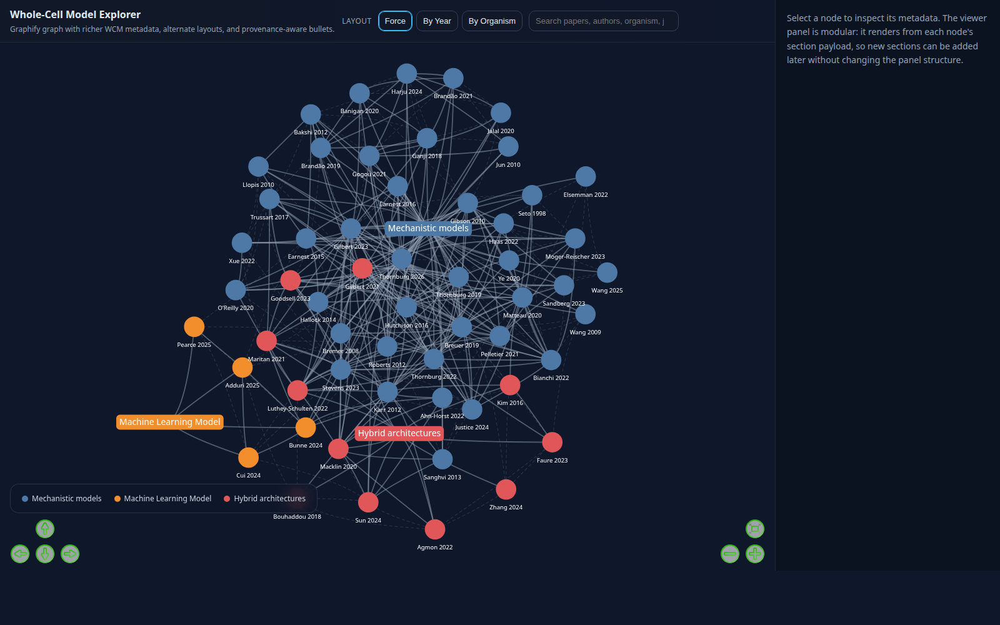

# Whole-Cell Model Paper Collection

<p align="center">
  <a href="https://freakingpotato.github.io/Whole-Cell-Model-Paper-Collection/">
    
  </a>
</p>

<p align="center">
  <a href="https://freakingpotato.github.io/Whole-Cell-Model-Paper-Collection/">
    
  </a>
</p>

<p align="center"><b>👉 <a href="https://freakingpotato.github.io/Whole-Cell-Model-Paper-Collection/">Click here to open the interactive Whole-Cell Model Explorer</a></b></p>

A curated literature collection for classic and closely related whole-cell-model papers, anchored on the 2026 *Cell* paper *Bringing the genetically minimal cell to life on a computer in 4D* and expanded outward to landmark whole-cell-model, minimal-cell, chromosome-organization, and spatial/stochastic modeling papers that support the same modeling stack.

The **Live Explorer** lets you browse the corpus as an interactive knowledge graph: switch between force, by-year, and by-organism layouts; hover any paper for title, abstract, methods summary, limitations, and future-work bullets; and jump straight to the DOI or the parsed PDF page anchor.

---

## ⭐ Related project — Knowledge Graph Agent

A more **systematic, agentic build** of the same idea — a general-purpose knowledge-graph builder, not limited to whole-cell-model papers — lives in a separate repo:

> **🔗 [FreakingPotato/Knowledge_Graph_Agent](https://github.com/FreakingPotato/Knowledge_Graph_Agent)**
>
> If you like what this corpus shows, that repo is where the methodology is being generalised: an agent-driven pipeline for harvesting, parsing, classifying, and graphing scientific literature across arbitrary domains. The Whole-Cell Model collection here was the first concrete dataset that motivated it.

---

## Table of Contents

- [Live Explorer](#live-explorer)
- [Current Status](#current-status)
- [Repository Layout](#repository-layout)
- [Knowledge Graph Outputs](#knowledge-graph-outputs)
- [Pipeline & Build](#pipeline--build)
- [Metadata Files](#metadata-files)
- [Notes & Conventions](#notes--conventions)

---

## Live Explorer

[**▶ Open the Live Explorer →**](https://freakingpotato.github.io/Whole-Cell-Model-Paper-Collection/)

What you can do in the explorer:

- **Three layouts** — force-directed, by year, by organism (with dashed guide columns and headings in structured layouts).
- **Cleaner labels** — `Author Year` on the graph, full title on hover and in the side panel.
- **Rich node details** — title, journal, year, abstract, methods summary, limitations, and future work.
- **Provenance-aware hovers** — limitation and future-work bullets link to parsed-PDF page anchors when an article PDF is available, plus the curated note section and the DOI / landing page.
- **Color = method class** — 🔵 Mechanistic models · 🟠 Machine Learning models · 🔴 Hybrid architectures.
- Subtle idle camera drift when the graph is not being manipulated.

GitHub Pages is published from the repository root; `index.html` redirects to `graphify-out/graph.html`, and `.nojekyll` keeps the viewer's relative links into `graphify_corpus/` working as plain static files.

---

## Current Status

- Canonical project state lives in `metadata/wcm_state.sqlite`.
- Live derived inventory currently tracks **56 papers**.
- Parsed local PDFs are tracked incrementally and reused by content hash.
- Non-article or mismatched downloads are quarantined under `pdfs/_rejected/` and excluded from graph provenance.

---

## Repository Layout

```
.
├── pdfs/                # Downloaded PDFs with normalized file names (gitignored on GitHub)
├── metadata/            # Canonical SQLite state plus derived CSV / JSON exports
├── scripts/             # Reproducible harvesting/build scripts and the modular `wcm/` pipeline package
├── graphify-out/        # Generated interactive graph + static exports
├── graphify_corpus/     # Per-paper assets the explorer links into
└── index.html           # Redirect to graphify-out/graph.html for GitHub Pages
```

---

## Knowledge Graph Outputs

All outputs land in `graphify-out/`:

| File | Purpose |
| --- | --- |
| `graph.html` | Main interactive viewer (the Live Explorer) |
| `graph_base.html` | Raw Graphify export (unenhanced) |
| `graph.json` | Graph data (nodes + edges) |
| `graph.graphml` | GraphML for Gephi / yEd |
| `graph.svg` | Static SVG snapshot |
| `GRAPH_REPORT.md` | Human-readable audit report |
| `metadata/wcm_paper_metadata.json` | Rich per-paper metadata used by the viewer |

Method-class colors come from the exported class catalog (`metadata/wcm_method_class_catalog.csv`):

- 🔵 **Blue** — Mechanistic models
- 🟠 **Orange** — Machine Learning models
- 🔴 **Red** — Hybrid architectures

Editable per-paper class assignments live in `metadata/wcm_method_classes.csv`.

---

## Pipeline & Build

Regenerate the graph or inspect state:

```bash
python scripts/build_wcm_graph.py                 # incremental rebuild
python scripts/build_wcm_graph.py --status        # show pipeline state
python scripts/build_wcm_graph.py --full-rebuild  # rebuild from scratch
```

`build_wcm_graph.py` runs an incremental SQLite-backed pipeline:

```
discover → sync → parse → match → normalize → enrich → classify → export
```

- Unchanged PDFs are not reparsed. The parser cache is keyed by file hash plus parser version, so canonical renames reuse existing parse state.
- New PDFs in `pdfs/` are auto-detected, matched to existing papers by `paper_id` prefix, DOI, and title evidence, then normalized to the canonical filename scheme.
- Auto-ingested papers receive a stable method-class key (`mechanistic`, `ml`, `hybrid`) plus editable display metadata.
- `scripts/build_wcm_collection.py` is now a bootstrap/import helper rather than the ongoing operational pipeline.

### Optional: Zotero sync

Set environment variables to enable Zotero round-tripping:

| Variable | Effect |
| --- | --- |
| `ZOTERO_USER_ID` + `ZOTERO_API_KEY` | Builder checks the `Whole Cell Model` collection and mirrors downloadable PDF attachments into `pdfs/` |
| `ZOTERO_UPLOAD_LOCAL=1` | Local PDFs missing from the Zotero collection are prepared for upload after local matching |
| `ZOTERO_DRY_RUN=1` | Show what would happen without changing the remote library |

Zotero items without a downloadable server-side file are recorded in `metadata/zotero_sync_state.json` and stay `landing_page_only` until a binary becomes available locally or remotely.

---

## Metadata Files

| File | Contents |
| --- | --- |
| `metadata/wcm_state.sqlite` | Canonical SQLite state store |
| `metadata/whole_cell_model_papers_master_table.csv` | Master table with the requested annotation columns |
| `metadata/wcm_method_class_catalog.csv` | Method-class catalog (stable keys, display labels, definitions, colors) |
| `metadata/wcm_method_classes.csv` | Editable per-paper class assignments |
| `metadata/curated_papers_inventory.csv` | Inventory with PDF status and file names |
| `metadata/live_paper_inventory.csv` | Live graph inventory with current method class, organism, and validated PDF bindings |
| `metadata/pdf_processing_status.csv` | Local PDF processing status |
| `metadata/pdf_parse_cache.json` | Parse cache (keyed by file hash + parser version) |
| `metadata/zotero_sync_state.json` | Local Zotero sync state |
| `metadata/pdf_sidecar_review_queue.csv` | Sidecar review queue |
| `metadata/pdf_sidecar_rejected.csv` | Rejected sidecars |
| `metadata/pdf_sidecar_summary.md` | Sidecar summary |
| `metadata/curated_papers_annotations.csv` | Annotation-only table |
| `metadata/seed_references_raw.json` | Raw seed-paper reference harvest |
| `metadata/candidate_papers.csv` | Candidate pool before final pruning |

The inventory is regenerated automatically from the SQLite state store on every build.

---

## Notes & Conventions

- The `summary`, `method summary`, `contribution`, `limitation`, and `future work` fields are concise synthesis notes for triage and reading prioritization — not extracted abstracts.
- For papers without directly accessible open PDFs, the inventories still record metadata and landing pages so the set remains organized.
- `pdfs/` is the source of truth for graph generation. The builder only scans top-level PDFs there and ignores `pdfs/_rejected/`.
- Local PDFs under `pdfs/` are intentionally gitignored for the GitHub repository; the metadata tables and graph still preserve their paper-level provenance.
- Hover-card section anchors are page-level approximations rather than perfect section bookmarks for every paper.
