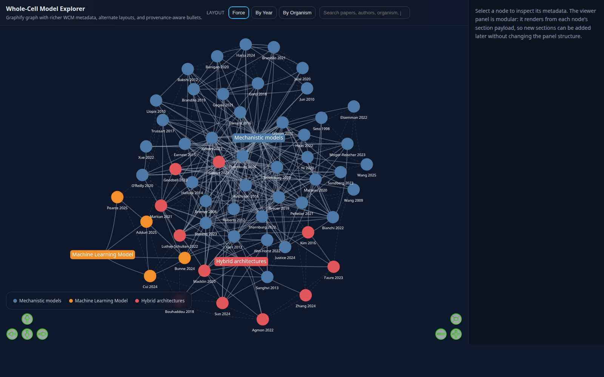

# Whole-Cell Model Paper Collection

<p align="center">
  <a href="https://freakingpotato.github.io/Whole-Cell-Model-Paper-Collection/">
    
  </a>
</p>

<p align="center">
  <a href="https://freakingpotato.github.io/Whole-Cell-Model-Paper-Collection/">
    
  </a>
</p>

<p align="center"><b>👉 <a href="https://freakingpotato.github.io/Whole-Cell-Model-Paper-Collection/">Click here to open the interactive Whole-Cell Model Explorer</a></b></p>

A curated literature collection for classic and closely related whole-cell-model papers, anchored on the 2026 *Cell* paper *Bringing the genetically minimal cell to life on a computer in 4D* and expanded outward to landmark whole-cell-model, minimal-cell, chromosome-organization, and spatial/stochastic modeling papers that support the same modeling stack.

The **Live Explorer** lets you browse the corpus as an interactive knowledge graph: switch between force, by-year, and by-organism layouts; hover any paper for title, abstract, methods summary, limitations, and future-work bullets; and jump straight to the DOI or the parsed PDF page anchor.

---

## ⭐ Related project — Knowledge Graph Agent

A more **systematic, agentic build** of the same idea — a general-purpose knowledge-graph builder, not limited to whole-cell-model papers — lives in a separate repo:

> **🔗 [FreakingPotato/Knowledge_Graph_Agent](https://github.com/FreakingPotato/Knowledge_Graph_Agent)**
>
> If you like what this corpus shows, that repo is where the methodology is being generalised: an agent-driven pipeline for harvesting, parsing, classifying, and graphing scientific literature across arbitrary domains. The Whole-Cell Model collection here was the first concrete dataset that motivated it.

---

## Table of Contents

- [Live Explorer](#live-explorer)
- [Current Status](#current-status)
- [Repository Layout](#repository-layout)
- [Knowledge Graph Outputs](#knowledge-graph-outputs)
- [Pipeline & Build](#pipeline--build)
- [Metadata Files](#metadata-files)
- [Notes & Conventions](#notes--conventions)

---

## Live Explorer

[**▶ Open the Live Explorer →**](https://freakingpotato.github.io/Whole-Cell-Model-Paper-Collection/)

What you can do in the explorer:

- **Four graph layouts + one evidence view** — force-directed, by year, by organism, **Virtual Cells** (groups papers by WCM completeness: Complete · Partial · Related), and **Hybrid Model Summary** (a non-graph evidence-table view, see below).
- **Cleaner labels** — `Author Year` on the graph, full title on hover and in the side panel.
- **Rich node details** — title, journal, year, citation count, abstract, methods summary, limitations, and future work.
- **Provenance-aware hovers** — limitation and future-work bullets link to parsed-PDF page anchors when an article PDF is available, plus the curated note section and the DOI / landing page.
- **Color = method class** — 🔵 Mechanistic models · 🟠 Machine Learning models · 🔴 Hybrid architectures.
- Subtle idle camera drift when the graph is not being manipulated.

### Hybrid Model Summary view

Argues that progress toward predictive whole-cell models will come from coordinating three complementary ML–mechanistic strategies, not from a single best paradigm:

1. **Embedded ML–MM hybridisation** — closure, constraint, emulation/surrogate.
2. **Pipeline ML→MM systems** — curation, inference, structural learning.
3. **Parallel ML–MM comparison** — matched predictions, agreement vs disagreement, foundation-model baselines.

Each paradigm card lists claims. Each claim expands into a ranked list of evidence bullets — drawn from **both the WCM corpus and a separate cross-domain pool of 89 high-impact papers (`EXT-NNN`)** in physics, fluids, climate, materials, chemistry, biology, and ML methods that combine mechanistic models with ML.

**Click any evidence bullet** to open a modal that shows the paper title and citation, a five-dimension rubric breakdown explaining why this paper supports this specific claim, and a **stack of paragraph-screenshot cards** — one per supporting sentence-group, each with its page number, an italic blockquote of the verbatim sentence, and a yellow-highlighted crop of the PDF context. Falls back to DOI / landing page for paywalled papers.

The five-dimension scoring rubric (high→low weight): Useful outcomes, Immediate benefit, Plausible, Scalable, How to validate. Each scored 0–5 → `weighted_total ∈ [0, 28]`. Promotion thresholds: ≥ 18 = `primary` evidence, 14–17 = `secondary`, < 14 = dropped.

#### Pipelines

Evidence and external-paper data are managed by four reproducible scripts plus the renderer:

```bash
# 1. Discover cross-domain candidates (10 per claim, OpenAlex + venue allowlist).
python scripts/discover_hybrid_candidates.py

# 2. Score each (paper, claim) pair against the 5-dim rubric.
#    (In the multi-agent run, this is split across 3 paradigm-specific scorers.
#     The script accepts --paradigm to handle one slice at a time.)

# 3. Review and promote candidates to primary / secondary evidence.
python scripts/review_hybrid_candidates.py

# 4. Rank evidence within each claim by impact (cited_by_count desc, year desc).
python scripts/rank_hybrid_evidence.py

# 5. Render multi-sentence paragraph screenshots from local PDFs.
python scripts/generate_evidence_screenshots.py            # idempotent
python scripts/generate_evidence_screenshots.py --force    # re-render all
python scripts/generate_evidence_screenshots.py --id <evidence_id>  # single point

# 6. Re-export the viewer (mirrors PNGs to graphify-out/evidence/).
python scripts/build_wcm_graph.py --stage export

# Validate any time:
python scripts/validate_hybrid_evidence.py
```

The canonical evidence file is `metadata/hybrid_model_evidence.json`. Sister files:

- `metadata/hybrid_external_papers.json` — registry of `EXT-NNN` cross-domain papers (title, DOI, OpenAlex id, abstract, citation count, domain).
- `metadata/hybrid_evidence_candidates.json` — every (paper, claim) row that was discovered, with rubric scores, weighted total, tier, and promotion status.
- `metadata/hybrid_evidence_promotion_log.md` — human-readable trace of what got promoted, demoted, or dropped, and why.
- `metadata/hybrid_rank_log.md` — per-claim ranked tables.

#### How modal previews work

When a user clicks an evidence bullet, the modal renders, in priority order:

1. **Multi-sentence screenshot stack** — when `point.screenshots` is a non-empty array. Each card shows ❶/❷/❸ caption pill (page number + section hint), the cropped PNG of the supporting passage with a yellow highlight, and the verbatim sentence as an italic blockquote below. Up to 5 cards stack vertically.
2. **Legacy single-image** — for backward compatibility with rows that only have `screenshot_href`.
3. **Embedded PDF iframe** — when only a local PDF + page anchor exist (`pdf_href` + `point.page`). Jumps to `#page=N`.
4. **DOI / landing-page fallback** — for paywalled rows. Shows the excerpt + DOI button.

The modal info panel (left side) also shows the **five-dimension rubric breakdown** with one-sentence rationales per dimension and the weighted total, plus an "Also matches N other claims" disclosure when the same paper supports multiple claims.

Screenshot renderer dependencies: `pymupdf` (PyMuPDF / `fitz`), `rapidfuzz`, and `nltk` (`punkt_tab` tokenizer). The multi-sentence renderer:

- Walks every text block on every page using `page.get_text("dict")`, splitting blocks into sentences via NLTK punkt.
- Scores each sentence against the evidence's `text` and `quote` (when present) using `rapidfuzz.partial_ratio` plus a rare-keyword bonus, with **penalties for reference-list lines and running headers** so bibliography entries / page-titles don't spuriously dominate.
- Keeps the top-5 sentences with score ≥ 60.
- Groups consecutive sentences (same page, adjacent line-bboxes) into one PNG with a single tighter highlight box; sentences on different pages each get their own PNG.
- Renders each group at 200 DPI, draws a translucent yellow rectangle, crops to the paragraph plus ~80 px context, saves as `docs/assets/evidence/<evidence_id>__NN.png` (≤ 200 KB each, iterative downscale + 128-color palette fallback).
- Writes the new array schema (`screenshots[]`, `screenshot_count`, `screenshot_strategy`, `confidence: parsed_pdf`) in place. Forced block-fallback only when no sentence ≥ 50 anywhere in the paper.
- Is idempotent — `--force` re-renders, `--id <evidence_id>` for a single point, never overwrites a `confidence: manual_verified` row.

The build step (`scripts/build_wcm_graph.py --stage export`) mirrors all referenced PNGs into `graphify-out/evidence/` and rewrites the *embedded* `screenshot_href` paths so the modal images resolve under both local file:// and GitHub Pages serving.

#### Adding new evidence

Each evidence point lives under a paradigm → claim and looks like:

```json
{
  "id": "hybrid-embedded-closure-001",
  "paper_id": "WCM-046",
  "text": "Concise plain-English summary of the support claim.",
  "section": "Results",
  "page": 3,
  "quote": "Optional verbatim excerpt (≤ 1 sentence is fine).",
  "confidence": "manual_verified | parsed_pdf | metadata_only | needs_review"
}
```

- `paper_id` must match an entry in `metadata/wcm_paper_metadata.json`. To cite a paper not yet in the corpus, set `"external_reference": true` and provide a `citation_label` + `doi`.
- `page` is consumed both by the iframe fallback (`#page=N`) and by the screenshot renderer.
- `confidence` defaults to `metadata_only`. The screenshot renderer auto-bumps to `parsed_pdf` when it succeeds. Use `manual_verified` to lock a curator-edited row from being overwritten.
- `screenshot_status` (set automatically): `ok` (PNG rendered), `not_found` (text didn't match anything in the PDF), `manual_review` (PDF was image-only / OCR'd), or `no_pdf` (paper is paywalled — fall back to DOI).
- The validation script flags missing `quote`/`page` anchors as warnings (non-fatal) so curators can deepen weaker rows over time. It also warns if a `screenshot_href` points at a missing file.

GitHub Pages is published from the repository root; `index.html` redirects to `graphify-out/graph.html`, and `.nojekyll` keeps the viewer's relative links into `graphify_corpus/` working as plain static files.

---

## Current Status

- Canonical project state lives in `metadata/wcm_state.sqlite`.
- Live derived inventory currently tracks **56 papers**.
- Parsed local PDFs are tracked incrementally and reused by content hash.
- Non-article or mismatched downloads are quarantined under `pdfs/_rejected/` and excluded from graph provenance.

---

## Repository Layout

```
.
├── pdfs/                # Downloaded PDFs with normalized file names (gitignored on GitHub)
├── metadata/            # Canonical SQLite state plus derived CSV / JSON exports
├── scripts/             # Reproducible harvesting/build scripts and the modular `wcm/` pipeline package
├── graphify-out/        # Generated interactive graph + static exports
├── graphify_corpus/     # Per-paper assets the explorer links into
└── index.html           # Redirect to graphify-out/graph.html for GitHub Pages
```

---

## Knowledge Graph Outputs

All outputs land in `graphify-out/`:

| File | Purpose |
| --- | --- |
| `graph.html` | Main interactive viewer (the Live Explorer) |
| `graph_base.html` | Raw Graphify export (unenhanced) |
| `graph.json` | Graph data (nodes + edges) |
| `graph.graphml` | GraphML for Gephi / yEd |
| `graph.svg` | Static SVG snapshot |
| `GRAPH_REPORT.md` | Human-readable audit report |
| `metadata/wcm_paper_metadata.json` | Rich per-paper metadata used by the viewer |

Method-class colors come from the exported class catalog (`metadata/wcm_method_class_catalog.csv`):

- 🔵 **Blue** — Mechanistic models
- 🟠 **Orange** — Machine Learning models
- 🔴 **Red** — Hybrid architectures

Editable per-paper class assignments live in `metadata/wcm_method_classes.csv`.

---

## Pipeline & Build

Regenerate the graph or inspect state:

```bash
python scripts/build_wcm_graph.py                 # incremental rebuild
python scripts/build_wcm_graph.py --status        # show pipeline state
python scripts/build_wcm_graph.py --full-rebuild  # rebuild from scratch
```

`build_wcm_graph.py` runs an incremental SQLite-backed pipeline:

```
discover → sync → parse → match → normalize → enrich → classify → export
```

- Unchanged PDFs are not reparsed. The parser cache is keyed by file hash plus parser version, so canonical renames reuse existing parse state.
- New PDFs in `pdfs/` are auto-detected, matched to existing papers by `paper_id` prefix, DOI, and title evidence, then normalized to the canonical filename scheme.
- Auto-ingested papers receive a stable method-class key (`mechanistic`, `ml`, `hybrid`) plus editable display metadata.
- `scripts/build_wcm_collection.py` is now a bootstrap/import helper rather than the ongoing operational pipeline.

### Optional: refresh citation counts

Citations come from OpenAlex during the normal `enrich` stage. For papers OpenAlex hasn't indexed yet (preprints, brand-new journals), you can run an explicit refresh that falls back to Semantic Scholar:

```bash
python scripts/build_wcm_graph.py --refresh-citations                  # all papers, persistent cache
python scripts/build_wcm_graph.py --refresh-citations --citations-only-missing
python scripts/build_wcm_graph.py --refresh-citations --citations-rate 3.0
```

Results are persisted in `metadata/citation_counts.json` and layered in at the next graph export, so the side panel shows the count and the source (`openalex` / `semantic_scholar`). Adapted from [`Knowledge_Graph_Agent`'s citations module](https://github.com/FreakingPotato/Knowledge_Graph_Agent/blob/main/scripts/kgbuild/citations.py).

### PDF parsing — content over metadata

`extract_pdf_profile` now extracts heuristic excerpts of the **abstract**, **introduction**, **methods**, and **references** directly from each PDF (cached by file hash + parser version). When OpenAlex has no abstract for a paper, the PDF excerpt fills the side panel automatically. Reference lists land in the parse cache for future cross-paper linking.

### Optional: Zotero sync

Set environment variables to enable Zotero round-tripping:

| Variable | Effect |
| --- | --- |
| `ZOTERO_USER_ID` + `ZOTERO_API_KEY` | Builder checks the `Whole Cell Model` collection and mirrors downloadable PDF attachments into `pdfs/` |
| `ZOTERO_UPLOAD_LOCAL=1` | Local PDFs missing from the Zotero collection are prepared for upload after local matching |
| `ZOTERO_DRY_RUN=1` | Show what would happen without changing the remote library |

Zotero items without a downloadable server-side file are recorded in `metadata/zotero_sync_state.json` and stay `landing_page_only` until a binary becomes available locally or remotely.

---

## Metadata Files

| File | Contents |
| --- | --- |
| `metadata/wcm_state.sqlite` | Canonical SQLite state store |
| `metadata/whole_cell_model_papers_master_table.csv` | Master table with the requested annotation columns |
| `metadata/wcm_method_class_catalog.csv` | Method-class catalog (stable keys, display labels, definitions, colors) |
| `metadata/wcm_method_classes.csv` | Editable per-paper class assignments |
| `metadata/curated_papers_inventory.csv` | Inventory with PDF status and file names |
| `metadata/live_paper_inventory.csv` | Live graph inventory with current method class, organism, and validated PDF bindings |
| `metadata/pdf_processing_status.csv` | Local PDF processing status |
| `metadata/pdf_parse_cache.json` | Parse cache (keyed by file hash + parser version) |
| `metadata/zotero_sync_state.json` | Local Zotero sync state |
| `metadata/pdf_sidecar_review_queue.csv` | Sidecar review queue |
| `metadata/pdf_sidecar_rejected.csv` | Rejected sidecars |
| `metadata/pdf_sidecar_summary.md` | Sidecar summary |
| `metadata/curated_papers_annotations.csv` | Annotation-only table |
| `metadata/seed_references_raw.json` | Raw seed-paper reference harvest |
| `metadata/candidate_papers.csv` | Candidate pool before final pruning |

The inventory is regenerated automatically from the SQLite state store on every build.

---

## Notes & Conventions

- The `summary`, `method summary`, `contribution`, `limitation`, and `future work` fields are concise synthesis notes for triage and reading prioritization — not extracted abstracts.
- For papers without directly accessible open PDFs, the inventories still record metadata and landing pages so the set remains organized.
- `pdfs/` is the source of truth for graph generation. The builder only scans top-level PDFs there and ignores `pdfs/_rejected/`.
- Local PDFs under `pdfs/` are intentionally gitignored for the GitHub repository; the metadata tables and graph still preserve their paper-level provenance.
- Hover-card section anchors are page-level approximations rather than perfect section bookmarks for every paper.
